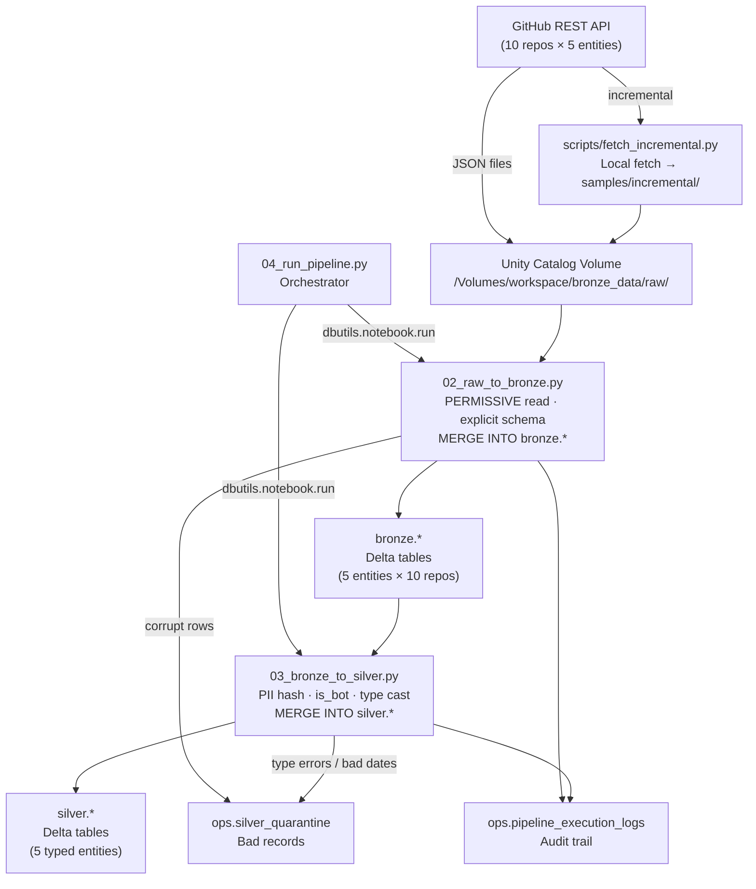

# DAV Database Trends — PySpark Medallion Pipeline

> **University Data Analysis & Visualization — Phase 2**  
> A production-grade PySpark Medallion pipeline (Bronze → Silver) on Databricks Free Edition,
> tracking 10 open-source database repositories via the GitHub REST API.

---

## Table of Contents

1. [Project Overview](#1-project-overview)
2. [Architecture](#2-architecture)
3. [Repository Layout](#3-repository-layout)
4. [Tracked Repositories](#4-tracked-repositories)
5. [Bronze Data Dictionary](#5-bronze-data-dictionary)
6. [Silver Data Dictionary](#6-silver-data-dictionary)
7. [Ops Tables](#7-ops-tables)
8. [Databricks Execution Guide](#8-databricks-execution-guide)
9. [Idempotency](#9-idempotency)
10. [Schema Drift Handling](#10-schema-drift-handling)
11. [PII Handling](#11-pii-handling)
12. [Known Caveats](#12-known-caveats)

---

## 1. Project Overview

This pipeline ingests raw JSON from the **GitHub REST API** for 10 database repositories
(relational, document, key-value, vector) into a **Medallion architecture** on
Databricks Serverless with Unity Catalog and Delta Lake.

| Layer | Storage | Technology | Purpose |
|---|---|---|---|
| **Source** | GitHub REST API | `scripts/fetch_incremental.py` | Pull raw JSON |
| **Bronze** | Unity Catalog Volume → Delta | `notebooks/02_raw_to_bronze.py` | Raw, schema-validated, idempotent |
| **Silver** | Unity Catalog Delta tables | `notebooks/03_bronze_to_silver.py` | Typed, PII-masked, deduplicated |
| **Gold** *(Phase 3)* | Unity Catalog Delta views | TBD | Star schema for BI/analytics |
| **Ops** | Unity Catalog Delta | `notebooks/01_setup.py` | Audit logs & quarantine |

**Design principles:**
- Zero schema inference — all `StructType` schemas are explicit in [`src/schemas.py`](src/schemas.py)
- Every record in Bronze and Silver carries a `load_timestamp`
- Idempotency via `MERGE INTO` (never append-only after table creation)
- PII masking with salted SHA-256 before data leaves Bronze
- Full audit trail in `ops.pipeline_execution_logs`

---

## 2. Architecture



---

## 3. Repository Layout

```
dav-database-trends/
├── notebooks/
│   ├── 01_setup.py              # Create UC schemas, Delta tables, ops tables
│   ├── 02_raw_to_bronze.py      # Raw JSON → Bronze Delta (MERGE INTO)
│   ├── 03_bronze_to_silver.py   # Bronze → Silver (PII, is_bot, quarantine)
│   └── 04_run_pipeline.py       # Orchestrator (incremental / backfill / drift)
├── src/
│   ├── schemas.py               # All explicit StructType schemas (Bronze + Silver + Ops)
│   └── common.py                # Shared helpers: get_params, log_run, merge_delta, hash_email
├── scripts/
│   ├── full_load.py             # Historical full ingest → bronze/
│   ├── fetch_incremental.py     # Incremental GitHub fetch → samples/incremental/
│   └── make_drift_sample.py     # Inject schema-drift anomalies into samples/drift/
├── samples/
│   ├── *.json                   # 5-record full-load slice (one repo)
│   ├── full_load/               # Full load samples (all entities)
│   ├── incremental/             # Output of fetch_incremental.py
│   └── drift/                   # Output of make_drift_sample.py (drift test data)
├── bronze/                      # Local raw JSON (gitignored in prod)
├── tests/
│   ├── check_schemas.py         # Validate schema fields against real JSON records
│   ├── test_schemas.py          # Unit tests for schema field coverage
│   └── test_common.py           # Unit tests for common.py helpers
├── docs/
│   ├── data_dictionary.md       # Full data dictionary (extended)
│   └── screenshots/             # Required Databricks screenshots (see checklist)
├── audit/
│   ├── bronze_quality_report.md # Full Bronze DQ audit
│   └── data_quality.md
└── progress.md                  # Project progress tracker
```

---

## 4. Tracked Repositories

| # | Repository | Category | Language | Notes |
|---|---|---|---|---|
| 1 | `postgres/postgres` | Relational | C | GitHub mirror — issues/PRs/releases disabled |
| 2 | `cockroachdb/cockroach` | Distributed SQL | Go | 41% bot commits (bors/TeamCity) |
| 3 | `mongodb/mongo` | Document | C++ | Issues tracked on external JIRA |
| 4 | `surrealdb/surrealdb` | Multi-model | Rust | — |
| 5 | `redis/redis` | Key-Value | C | — |
| 6 | `apache/cassandra` | Wide-Column | Java | Issues tracked on Apache JIRA |
| 7 | `facebookresearch/faiss` | Vector (CPU) | C++ | 27.8% unlinked authors (Meta internal emails) |
| 8 | `qdrant/qdrant` | Vector | Rust | GitHub start: 2021 |
| 9 | `milvus-io/milvus` | Vector | Go | — |
| 10 | `chroma-core/chroma` | Vector | Python | — |

---

## 5. Bronze Data Dictionary

All Bronze schemas are defined in [`src/schemas.py`](src/schemas.py) using explicit
`StructType`/`StructField`. Schema inference (`inferSchema`) is never used.
Every Bronze table adds `repo_full_name`, `load_timestamp`, `_source_file`, and `batch_id`
at ingest time. All Bronze schemas include `_corrupt_record` (StringType) for Spark PERMISSIVE mode.

### 5.1 `bronze.commits`
Primary key: `(repo_full_name, sha)` · Date filter column: `commit.author.date`

| Column | Type | Nullable | PK | Description |
|---|---|---|---|---|
| `sha` | STRING | ✗ | ✓ | Full Git commit SHA |
| `node_id` | STRING | ✓ | | GitHub GraphQL node ID |
| `commit.author.name` | STRING | ✓ | | Author display name (dropped in Silver) |
| `commit.author.email` | STRING | ✓ | | Author email — PII hashed in Silver |
| `commit.author.date` | STRING | ✓ | | Commit author timestamp (ISO-8601) |
| `commit.committer.name` | STRING | ✓ | | Committer display name (dropped in Silver) |
| `commit.committer.email` | STRING | ✓ | | Committer email — PII hashed in Silver |
| `commit.committer.date` | STRING | ✓ | | Committer timestamp |
| `commit.message` | STRING | ✓ | | Full commit message — headline only kept in Silver |
| `commit.comment_count` | INTEGER | ✓ | | Number of commit comments |
| `commit.verification.verified` | BOOLEAN | ✓ | | GPG signature valid |
| `author.login` | STRING | ✓ | | GitHub actor login |
| `author.id` | LONG | ✓ | | GitHub actor numeric ID |
| `author.type` | STRING | ✓ | | `"User"` or `"Bot"` |
| `committer.login` | STRING | ✓ | | GitHub committer login |
| `committer.type` | STRING | ✓ | | `"User"` or `"Bot"` |
| `parents` | ARRAY\<STRUCT\> | ✓ | | Parent commit SHAs |
| `repo_full_name` | STRING | ✗ | ✓ | Injected: `owner/repo` |
| `load_timestamp` | TIMESTAMP | ✗ | | Injected: batch ingest time (UTC) |
| `_source_file` | STRING | ✓ | | Injected: Volume file path |
| `batch_id` | STRING | ✓ | | Injected: pipeline run identifier |
| `_corrupt_record` | STRING | ✓ | | Spark PERMISSIVE mode: raw corrupt JSON |

### 5.2 `bronze.issues`
Primary key: `(repo_full_name, id)` · Date filter column: `updated_at`

| Column | Type | Nullable | PK | Description |
|---|---|---|---|---|
| `id` | LONG | ✗ | ✓ | GitHub issue numeric ID |
| `number` | INTEGER | ✗ | | Issue number (human-visible) |
| `state` | STRING | ✓ | | `"open"` or `"closed"` |
| `state_reason` | STRING | ✓ | | Closure reason |
| `title` | STRING | ✓ | | Issue title |
| `body` | STRING | ✓ | | Issue body text |
| `user.login` | STRING | ✓ | | Author GitHub login |
| `user.id` | LONG | ✓ | | Author GitHub ID |
| `user.type` | STRING | ✓ | | `"User"` or `"Bot"` |
| `labels` | ARRAY\<STRUCT\> | ✓ | | Label id, name, color |
| `assignees` | ARRAY\<STRUCT\> | ✓ | | Assignee user structs |
| `milestone.title` | STRING | ✓ | | Milestone name |
| `comments` | INTEGER | ✓ | | Comment count |
| `created_at` | STRING | ✓ | | Creation timestamp (ISO-8601) |
| `updated_at` | STRING | ✓ | | Last update timestamp |
| `closed_at` | STRING | ✓ | | Closure timestamp (nullable for open) |
| `author_association` | STRING | ✓ | | `"MEMBER"`, `"CONTRIBUTOR"`, etc. |
| `pull_request` | STRUCT | ✓ | | **Non-null = this is a PR, not an issue** |
| `draft` | BOOLEAN | ✓ | | Draft state |
| `repo_full_name` | STRING | ✗ | ✓ | Injected |
| `load_timestamp` | TIMESTAMP | ✗ | | Injected |
| `_source_file` | STRING | ✓ | | Injected |
| `batch_id` | STRING | ✓ | | Injected |
| `_corrupt_record` | STRING | ✓ | | PERMISSIVE mode |

### 5.3 `bronze.pull_requests`
Primary key: `(repo_full_name, id)` · Date filter column: `updated_at`

| Column | Type | Nullable | PK | Description |
|---|---|---|---|---|
| `id` | LONG | ✗ | ✓ | GitHub PR numeric ID |
| `number` | INTEGER | ✗ | | PR number |
| `state` | STRING | ✓ | | `"open"` or `"closed"` |
| `title` | STRING | ✓ | | PR title |
| `user.login` | STRING | ✓ | | Author login |
| `user.type` | STRING | ✓ | | `"User"` or `"Bot"` |
| `created_at` | STRING | ✓ | | Creation timestamp |
| `updated_at` | STRING | ✓ | | Last update timestamp |
| `closed_at` | STRING | ✓ | | Closure timestamp |
| `merged_at` | STRING | ✓ | | Merge timestamp |
| `merge_commit_sha` | STRING | ✓ | | SHA of merge commit |
| `draft` | BOOLEAN | ✓ | | Draft PR flag |
| `head.ref` | STRING | ✓ | | Source branch name |
| `base.ref` | STRING | ✓ | | Target branch name |
| `labels` | ARRAY\<STRUCT\> | ✓ | | PR labels |
| `assignees` | ARRAY\<STRUCT\> | ✓ | | Assignee structs |
| `requested_reviewers` | ARRAY\<STRUCT\> | ✓ | | Reviewer structs |
| `author_association` | STRING | ✓ | | Contributor role |
| `auto_merge` | STRING | ✓ | | Auto-merge config |
| `repo_full_name` | STRING | ✗ | ✓ | Injected |
| `load_timestamp` | TIMESTAMP | ✗ | | Injected |
| `_source_file` | STRING | ✓ | | Injected |
| `batch_id` | STRING | ✓ | | Injected |
| `_corrupt_record` | STRING | ✓ | | PERMISSIVE mode |

### 5.4 `bronze.releases`
Primary key: `(repo_full_name, id)` · Date filter column: `published_at`

| Column | Type | Nullable | PK | Description |
|---|---|---|---|---|
| `id` | LONG | ✗ | ✓ | Release numeric ID |
| `tag_name` | STRING | ✓ | | Git tag (e.g. `v1.4.0`) |
| `name` | STRING | ✓ | | Release display name |
| `draft` | BOOLEAN | ✓ | | Unpublished draft |
| `prerelease` | BOOLEAN | ✓ | | Pre-release flag |
| `created_at` | STRING | ✓ | | Tag creation time |
| `published_at` | STRING | ✓ | | Publication time |
| `author.login` | STRING | ✓ | | Releasing actor |
| `assets` | ARRAY\<STRUCT\> | ✓ | | Downloadable assets (id, name, size, download_count) |
| `body` | STRING | ✓ | | Release notes |
| `tarball_url` | STRING | ✓ | | Source tarball URL |
| `zipball_url` | STRING | ✓ | | Source zip URL |
| `repo_full_name` | STRING | ✗ | ✓ | Injected |
| `load_timestamp` | TIMESTAMP | ✗ | | Injected |
| `_source_file` | STRING | ✓ | | Injected |
| `batch_id` | STRING | ✓ | | Injected |
| `_corrupt_record` | STRING | ✓ | | PERMISSIVE mode |

### 5.5 `bronze.repo_metadata`
Primary key: `(repo_full_name, id)` · Single-record per repo per run

| Column | Type | Nullable | PK | Description |
|---|---|---|---|---|
| `id` | LONG | ✗ | ✓ | Repository numeric ID |
| `full_name` | STRING | ✗ | ✓ | `owner/repo` |
| `name` | STRING | ✓ | | Short repository name |
| `description` | STRING | ✓ | | Repository description |
| `private` | BOOLEAN | ✓ | | Private flag (always false for tracked repos) |
| `fork` | BOOLEAN | ✓ | | Fork flag |
| `owner.login` | STRING | ✓ | | Owner login |
| `owner.type` | STRING | ✓ | | `"Organization"` or `"User"` |
| `created_at` | STRING | ✓ | | Repository creation time |
| `updated_at` | STRING | ✓ | | Last metadata update |
| `pushed_at` | STRING | ✓ | | Last commit push time |
| `size` | LONG | ✓ | | Repository size (KB) |
| `stargazers_count` | INTEGER | ✓ | | Star count |
| `watchers_count` | INTEGER | ✓ | | Watcher count |
| `forks_count` | INTEGER | ✓ | | Fork count |
| `open_issues_count` | INTEGER | ✓ | | Open issues (includes PRs) |
| `language` | STRING | ✓ | | Primary language |
| `default_branch` | STRING | ✓ | | Default branch name |
| `topics` | ARRAY\<STRING\> | ✓ | | Repository topic tags |
| `license.spdx_id` | STRING | ✓ | | SPDX license identifier |
| `subscribers_count` | INTEGER | ✓ | | Subscriber (watch) count |
| `network_count` | INTEGER | ✓ | | Network fork count |
| `repo_full_name` | STRING | ✗ | ✓ | Injected |
| `load_timestamp` | TIMESTAMP | ✗ | | Injected |
| `_source_file` | STRING | ✓ | | Injected |
| `batch_id` | STRING | ✓ | | Injected |
| `_corrupt_record` | STRING | ✓ | | PERMISSIVE mode |

---

## 6. Silver Data Dictionary

Silver tables are typed, deduplicated, and PII-masked. All schemas defined in
[`src/schemas.py`](src/schemas.py) (`SILVER_*_SCHEMA`). Every Silver row carries `load_timestamp`.

### 6.1 `silver.commits`
Primary key: `(repo_full_name, commit_sha)` · Source: `bronze.commits`

| Column | Type | Nullable | PK | Description |
|---|---|---|---|---|
| `repo_full_name` | STRING | ✗ | ✓ | `owner/repo` |
| `commit_sha` | STRING | ✗ | ✓ | Full Git SHA |
| `author_login` | STRING | ✓ | | GitHub login (null if unlinked, e.g. Meta internal) |
| `author_id` | LONG | ✓ | | GitHub numeric user ID |
| `author_email_hash` | STRING | ✓ | | `SHA-256(lower(trim(email)) + salt)` — raw email dropped |
| `committer_email_hash` | STRING | ✓ | | Same hashing as above |
| `commit_date_utc` | TIMESTAMP | ✓ | | Parsed UTC timestamp |
| `commit_headline` | STRING | ✓ | | First line of message; Signed-off-by/Co-authored-by stripped |
| `comment_count` | INTEGER | ✓ | | Commit comment count |
| `is_bot` | BOOLEAN | ✗ | | True if login contains `[bot]`, type=`Bot`, or known CI account |
| `_source_file` | STRING | ✓ | | Volume file path |
| `load_timestamp` | TIMESTAMP | ✗ | | Silver ingest time (UTC) |

### 6.2 `silver.issues`
Primary key: `(repo_full_name, issue_number)` · Source: `bronze.issues` WHERE `pull_request IS NULL`

| Column | Type | Nullable | PK | Description |
|---|---|---|---|---|
| `repo_full_name` | STRING | ✗ | ✓ | `owner/repo` |
| `issue_number` | INTEGER | ✗ | ✓ | Issue number |
| `issue_id` | LONG | ✗ | | GitHub issue ID |
| `title` | STRING | ✓ | | Issue title |
| `state` | STRING | ✓ | | `"open"` or `"closed"` |
| `author_login` | STRING | ✓ | | Reporter login |
| `author_id` | LONG | ✓ | | Reporter numeric ID |
| `is_bot` | BOOLEAN | ✗ | | Bot-filed issue flag |
| `created_at_utc` | TIMESTAMP | ✓ | | Parsed UTC creation time |
| `updated_at_utc` | TIMESTAMP | ✓ | | Parsed UTC update time |
| `closed_at_utc` | TIMESTAMP | ✓ | | Parsed UTC close time (null if open) |
| `comments_count` | INTEGER | ✓ | | Comment count |
| `labels_list` | ARRAY\<STRING\> | ✓ | | Label names only |
| `_source_file` | STRING | ✓ | | Volume file path |
| `load_timestamp` | TIMESTAMP | ✗ | | Silver ingest time (UTC) |

> **Note:** Cassandra and MongoDB will always have **0 rows** in `silver.issues`.
> Their `bronze.issues` files contain only PR entries (100% `pull_request IS NOT NULL`).
> Issue tracking for these projects lives on external ASF/MongoDB JIRA instances.

### 6.3 `silver.pull_requests`
Primary key: `(repo_full_name, pr_number)` · Source: `bronze.pull_requests`

| Column | Type | Nullable | PK | Description |
|---|---|---|---|---|
| `repo_full_name` | STRING | ✗ | ✓ | `owner/repo` |
| `pr_number` | INTEGER | ✗ | ✓ | PR number |
| `pr_id` | LONG | ✗ | | GitHub PR ID |
| `title` | STRING | ✓ | | PR title |
| `state` | STRING | ✓ | | `"open"` or `"closed"` |
| `author_login` | STRING | ✓ | | PR author login |
| `is_bot` | BOOLEAN | ✗ | | Bot-authored PR flag |
| `created_at_utc` | TIMESTAMP | ✓ | | Parsed UTC creation time |
| `updated_at_utc` | TIMESTAMP | ✓ | | Parsed UTC update time |
| `closed_at_utc` | TIMESTAMP | ✓ | | Parsed UTC close time |
| `merged_at_utc` | TIMESTAMP | ✓ | | Parsed UTC merge time (null if unmerged) |
| `is_merged` | BOOLEAN | ✗ | | Derived: `merged_at IS NOT NULL` |
| `merge_commit_sha` | STRING | ✓ | | SHA of merge commit |
| `head_branch` | STRING | ✓ | | Source branch (`head.ref`) |
| `base_branch` | STRING | ✓ | | Target branch (`base.ref`) |
| `_source_file` | STRING | ✓ | | Volume file path |
| `load_timestamp` | TIMESTAMP | ✗ | | Silver ingest time (UTC) |

### 6.4 `silver.releases`
Primary key: `(repo_full_name, release_id)` · Source: `bronze.releases`

| Column | Type | Nullable | PK | Description |
|---|---|---|---|---|
| `repo_full_name` | STRING | ✗ | ✓ | `owner/repo` |
| `release_id` | LONG | ✗ | ✓ | Release numeric ID |
| `tag_name` | STRING | ✓ | | Git tag (e.g. `v1.4.0`) |
| `release_name` | STRING | ✓ | | Display name |
| `is_draft` | BOOLEAN | ✗ | | Unpublished draft flag |
| `is_prerelease` | BOOLEAN | ✗ | | Pre-release flag |
| `published_at_utc` | TIMESTAMP | ✓ | | Publication time (UTC) |
| `assets_count` | INTEGER | ✓ | | Number of release assets |
| `_source_file` | STRING | ✓ | | Volume file path |
| `load_timestamp` | TIMESTAMP | ✗ | | Silver ingest time (UTC) |

### 6.5 `silver.repo_metadata`
Primary key: `(repo_id, repo_full_name)` · Source: `bronze.repo_metadata`

| Column | Type | Nullable | PK | Description |
|---|---|---|---|---|
| `repo_id` | LONG | ✗ | ✓ | Repository numeric ID |
| `repo_full_name` | STRING | ✗ | ✓ | `owner/repo` |
| `repo_name` | STRING | ✓ | | Short repository name |
| `owner_login` | STRING | ✓ | | Owner organization/user login |
| `description` | STRING | ✓ | | Repository description |
| `default_branch` | STRING | ✓ | | Default branch |
| `license_spdx_id` | STRING | ✓ | | SPDX license identifier |
| `stargazers_count` | INTEGER | ✓ | | Star count |
| `forks_count` | INTEGER | ✓ | | Fork count |
| `open_issues_count` | INTEGER | ✓ | | Open issue+PR count |
| `created_at_utc` | TIMESTAMP | ✓ | | Repository creation time |
| `updated_at_utc` | TIMESTAMP | ✓ | | Last metadata update |
| `pushed_at_utc` | TIMESTAMP | ✓ | | Last push time |
| `topics` | ARRAY\<STRING\> | ✓ | | Repository topic tags |
| `_source_file` | STRING | ✓ | | Volume file path |
| `load_timestamp` | TIMESTAMP | ✗ | | Silver ingest time (UTC) |

---

## 7. Ops Tables

Both tables live in the `ops` schema of the Unity Catalog and are created by
[`notebooks/01_setup.py`](notebooks/01_setup.py).

### 7.1 `ops.pipeline_execution_logs`

One row written per `(notebook, entity, repo)` invocation. Used for SLA monitoring
and drift detection audit trails.

| Column | Type | Nullable | Description |
|---|---|---|---|
| `log_id` | STRING | ✗ | UUID for this log entry |
| `layer` | STRING | ✗ | `"bronze"` or `"silver"` |
| `parameter_file` | STRING | ✗ | Notebook + entity + repo combination |
| `start_time` | TIMESTAMP | ✗ | Run start time (UTC) |
| `end_time` | TIMESTAMP | ✓ | Run end time (null while in-flight) |
| `status` | STRING | ✗ | `"SUCCESS"` or `"FAILURE"` |
| `rows_inserted` | LONG | ✓ | Delta `numTargetRowsInserted` metric |
| `rows_updated` | LONG | ✓ | Delta `numTargetRowsUpdated` metric |
| `error_message` | STRING | ✓ | Exception message / drift notes |
| `load_timestamp` | TIMESTAMP | ✗ | Row write time |

### 7.2 `ops.silver_quarantine`

Rows routed here instead of to Silver tables when they fail validation.
The batch continues; no run is cancelled by quarantine events.

| Column | Type | Nullable | Description |
|---|---|---|---|
| `quarantine_id` | STRING | ✗ | UUID for this quarantine entry |
| `layer` | STRING | ✗ | `"bronze"` or `"silver"` |
| `entity` | STRING | ✗ | Source entity (`commits`, `issues`, etc.) |
| `repo_full_name` | STRING | ✓ | Source repository |
| `rejection_reason` | STRING | ✗ | E.g. `"_corrupt_record"`, `"type_mismatch: comments cannot cast to int"`, `"unparseable_date: created_at"`, `"null_primary_key"` |
| `raw_payload` | STRING | ✓ | Full JSON of the rejected record |
| `load_timestamp` | TIMESTAMP | ✗ | Quarantine write time |

**Rejection reason taxonomy:**

| Code | Trigger |
|---|---|
| `_corrupt_record` | Spark PERMISSIVE mode detected malformed JSON |
| `null_primary_key` | PK field (`sha` / `id`) is null after parsing |
| `type_mismatch: <field>` | Field cannot be cast to the Silver type |
| `unparseable_date: <field>` | ISO-8601 timestamp parse failure |

---

## 8. Databricks Execution Guide

### 8.1 Prerequisites

| Requirement | Detail |
|---|---|
| Databricks Free Edition | Serverless compute (no RDD API, no custom Spark configs) |
| Unity Catalog | Enabled on your Databricks workspace |
| GitHub Token | Personal Access Token with `public_repo` scope |

### 8.2 Step 1 — Upload notebooks via Git Folder

1. In your Databricks workspace, go to **Workspace → Git Folders**
2. Click **Add a Git Folder** → paste your GitHub repo URL
3. All files under `notebooks/` appear as Databricks notebooks automatically

### 8.3 Step 2 — Upload raw data to Unity Catalog Volume

```bash
# Local: generate full-load Bronze data
export GITHUB_TOKEN=ghp_...
python full_load.py

# Upload bronze/ to the Volume
databricks fs cp -r bronze/ \
  dbfs:/Volumes/workspace/bronze_data/raw/ --recursive
```

Or drag-and-drop the `bronze/` folder in the **Catalog → Volumes** UI.

### 8.4 Step 3 — Create the salt secret

```bash
databricks secrets create-scope --scope dbtrends
databricks secrets put --scope dbtrends --key salt \
  --string-value "$(python -c 'import secrets; print(secrets.token_hex(32))')"
```

> ⚠️ The salt must never change after the first Silver run. Changing it invalidates all
> existing `author_email_hash` values. Store it in your password manager.

### 8.5 Step 4 — Run `01_setup.py` once

Open `notebooks/01_setup.py` in Databricks and click **Run All**.
This creates:
- `<catalog>.bronze.*` (5 Delta tables)
- `<catalog>.silver.*` (5 Delta tables)
- `<catalog>.ops.pipeline_execution_logs`
- `<catalog>.ops.silver_quarantine`

---

### 8.6 Widget Reference

#### Standard Incremental Run (nightly cadence)

Run `notebooks/04_run_pipeline.py` with **Section A** enabled:

| Widget | Value | Notes |
|---|---|---|
| `catalog` | `workspace` | Your Unity Catalog name |
| `base_path` | `/Volumes/workspace/bronze_data/raw` | Volume path |
| `repo` | `ALL` | Runs all 10 repos |
| `since` | `2026-09-25T00:00:00Z` | Previous run cutoff |
| `until` | *(empty)* | No upper bound |
| `run_mode` | `incremental` | Filters by since/until |
| `batch_id` | *(empty)* | Auto-generated |

#### Backfill Run (single repo, explicit window)

| Widget | Value | Notes |
|---|---|---|
| `catalog` | `workspace` | |
| `base_path` | `/Volumes/workspace/bronze_data/raw` | |
| `repo` | `surrealdb/surrealdb` | Single repo |
| `since` | `2026-04-01T00:00:00Z` | Window start |
| `until` | `2026-06-30T23:59:59Z` | Window end |
| `run_mode` | `backfill` | Applies both filters |
| `batch_id` | `backfill_surrealdb_q1fy26` | Human-readable label |

#### Full Load (all data, no date filtering)

| Widget | Value | Notes |
|---|---|---|
| `catalog` | `workspace` | |
| `base_path` | `/Volumes/workspace/bronze_data/raw` | |
| `repo` | `ALL` | All 10 repos |
| `since` | *(empty)* | No lower bound |
| `until` | *(empty)* | No upper bound |
| `run_mode` | `full` | No date filter applied |
| `batch_id` | `full_load_2026_04_to_09` | |

#### Drift Test

1. Run locally: `python scripts/make_drift_sample.py`
2. Upload `samples/drift/` to `/Volumes/workspace/bronze_data/raw/drift/`
3. Run Section C of `04_run_pipeline.py` with `base_path = /Volumes/.../raw/drift`

---

## 9. Idempotency

Every write in the pipeline uses **Delta `MERGE INTO`**, never `INSERT` or
`DataFrame.write.append` after table creation.

**Bronze MERGE key:** `(repo_full_name, sha)` for commits; `(repo_full_name, id)` for all others  
**Silver MERGE key:** `(repo_full_name, commit_sha)` / `(repo_full_name, issue_number)` / etc.

**Idempotency proof** is built into Section D of `notebooks/04_run_pipeline.py`:
- Runs the same batch twice with the identical `batch_id`
- Captures row counts before and after the second pass
- Raises `AssertionError` if **any** table changes

```
[D-4] Idempotency assertion
  ✓ PASS: workspace.bronze.commits        count=414 (unchanged)
  ✓ PASS: workspace.silver.commits        count=414 (unchanged)
  ...
  ✓ IDEMPOTENCY CONFIRMED
```

---

## 10. Schema Drift Handling

The Bronze notebook (`02_raw_to_bronze.py`) reads JSON with `PERMISSIVE` mode and
an explicit schema. When the API adds new fields not in the schema:

1. **Detection:** Extra columns are identified by comparing `df.columns` against
   the declared schema fields; drift is logged in `ops.pipeline_execution_logs.error_message`.
2. **Absorption:** Writes use `option("mergeSchema", "true")` so the new column is
   added to the Delta table without failing the run.
3. **Quarantine:** Rows with a non-null `_corrupt_record` (truly unparseable JSON)
   are routed to `ops.silver_quarantine` with `rejection_reason = "_corrupt_record"`.

**Test this end-to-end:**

```bash
# 1. Generate drift samples locally
python scripts/make_drift_sample.py
# Output: samples/drift/issues.json  (anomalies A, B, C)
#         samples/drift/commits.json (anomaly A only)

# 2. Upload to Volume then run Section C of 04_run_pipeline.py
```

Anomalies injected by `make_drift_sample.py`:

| Anomaly | Scope | Effect in Pipeline |
|---|---|---|
| **A** — `new_field_test` added to all records | issues + commits | Bronze logs drift, mergeSchema evolves table |
| **B** — `comments = "many"` (string, not int) on 3 records | issues only | Silver quarantines 3 rows (`type_mismatch`) |
| **C** — `created_at = "not-a-date"` on 1 record | issues only | Silver quarantines 1 row (`unparseable_date`) |

---

## 11. PII Handling

Author and committer emails in `commits.json` are **direct PII** subject to GDPR/PDPA.

**Protocol:**
1. A random 32-byte hex salt is stored in Databricks Secrets (`dbtrends/salt`)
2. In `03_bronze_to_silver.py`, **before any Silver write:**
   - `author_email_hash = SHA-256(lower(trim(email)) + salt)`
   - `committer_email_hash = SHA-256(lower(trim(email)) + salt)`
   - Raw emails and names are **never written to Silver**
3. Commit messages are truncated to the subject line; `Signed-off-by:` and `Co-authored-by:` trailers (which often contain emails) are stripped by regex

**Implemented in:** [`src/common.py`](src/common.py) — `hash_email(col, salt)` and `sanitize_commit_message(col)`

> ⚠️ The salt **must not change** after the first production Silver run.
> Re-hashing with a different salt produces different hashes, breaking all joins on `author_email_hash`.

---

## 12. Known Caveats

| # | Caveat | Repos Affected | Impact |
|---|---|---|---|
| 1 | **GitHub Issues/PRs/Releases disabled** | `postgres/postgres` | 0 rows in `silver.issues`, `silver.pull_requests`, `silver.releases`. Development happens on `pgsql-hackers` mailing list and commitfest. |
| 2 | **External JIRA — Issues are PRs** | `apache/cassandra`, `mongodb/mongo` | `issues.json` contains **0 true issues** (100% PRs). `silver.issues` is empty for both. Bug resolution time metrics cannot be computed from GitHub data. |
| 3 | **GitHub Releases not used** | `apache/cassandra`, `cockroachdb/cockroach`, `mongodb/mongo` | `silver.releases` is empty; use Git tags for release cadence analysis. |
| 4 | **Heavy CI/CD bot activity** | `cockroachdb/cockroach` (41.2%), `mongodb/mongo` (8.4%) | All bot rows are flagged `is_bot=true` in Silver. Filter `WHERE NOT is_bot` for human developer velocity metrics. |
| 5 | **Unlinked commit authors** | `facebookresearch/faiss` (27.8%), `chroma-core/chroma` (6.7%) | `author_login` is null for internal corporate emails (`@meta.com`). `author_email_hash` is the fallback identity key. |
| 6 | **Qdrant start date** | `qdrant/qdrant` | Repository created in 2021; the 6-month analysis window (Apr–Sep 2026) captures only recent activity. Historical commit data is not available through the 2,000-record API cap. |
| 7 | **Pagination cap (2,000 records)** | All high-velocity repos | CockroachDB (1.4%), MongoDB (1.2%), PostgreSQL (3.2%) cover only recent 2026 history. Cross-repo comparisons must use per-unit-time velocity (e.g. commits/week), not all-time totals. |
| 8 | **Releases feed gap** | Cassandra, CockroachDB, MongoDB, Postgres | 4 of 10 repos have 0 `silver.releases` rows. Release cadence comparison is only valid across the remaining 6. |